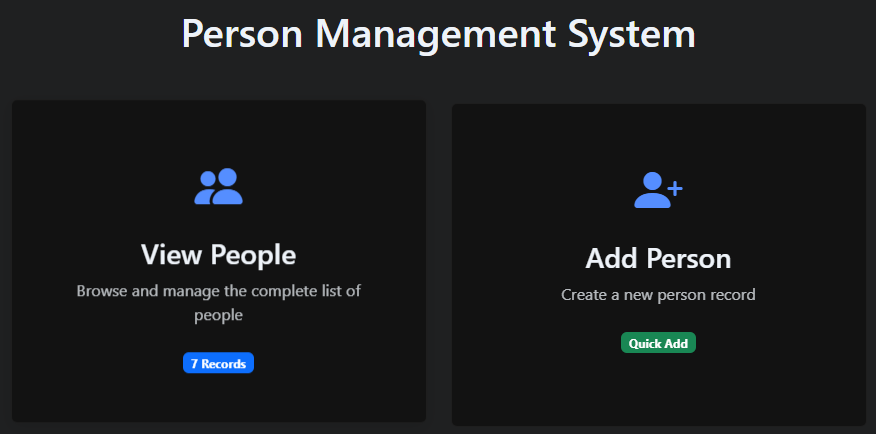

# Person Management System

A modern web-based person management application built with InterSystems IRIS and Bootstrap 5.



## 🌟 Features

### Dashboard
- Modern, card-based interface
- Real-time record count
- Interactive UI elements with hover effects
- Responsive design for all devices

### Person Management
- **View & Search**
  - Advanced wildcard search support
  - Multi-term filtering
  - Sortable table layout
  - Real-time search results

- **Data Operations**
  - Create new person records
  - Edit existing records
  - Delete with confirmation
  - Auto-calculated age from date of birth

### Technical Features
- Bootstrap 5 for responsive design
- Dynamic SQL queries
- Error handling and validation
- Automatic sample data generation
- CSP-based architecture

## 🚀 Getting Started

### Prerequisites
- InterSystems IRIS (version 2022.1 or later)
- Web browser with JavaScript enabled

### Installation
1. Clone this repository to your local IRIS installation:
```bash
git clone https://github.com/navercm418/irisBootStrapApp.git
```

2. Import the `Demo` folder into your IRIS namespace using Studio or VS Code

3. Compile all classes:
```objectscript
do $system.OBJ.CompileAll()
```

4. Access the application:
```
http://localhost:52773/csp/user/Demo.BootstrapApp.cls
```

## 📁 Project Structure

```
Demo/
├── BootstrapApp.cls    # Main application & dashboard
├── EditPerson.cls      # Edit person interface
├── NewPerson.cls       # New person form
└── person.cls          # Person data class
```

## 💡 Usage

### Search Examples
- Use `*` as a wildcard: `jo*` finds "John", "Joseph"
- Multiple terms: `jo* sm*` finds "John Smith"
- Case-insensitive searching
- Real-time filtering as you type

### Person Records
- Create new records with validation
- Edit existing records
- Auto-calculated age based on birth date
- Secure delete with confirmation

## 🛠 Technologies Used

- InterSystems IRIS
- Bootstrap 5.3.0
- Bootstrap Icons
- HTML5/CSS3
- JavaScript (ES6+)

## 📝 License

This project is licensed under the MIT License - see the [LICENSE](LICENSE) file for details.

## 🤝 Contributing

1. Fork the Project
2. Create your Feature Branch (`git checkout -b feature/AmazingFeature`)
3. Commit your Changes (`git commit -m 'Add some AmazingFeature'`)
4. Push to the Branch (`git push origin feature/AmazingFeature`)
5. Open a Pull Request

## ✨ Acknowledgments

- Built with InterSystems IRIS
- Styled with Bootstrap 5
- Icons from Bootstrap Icons
